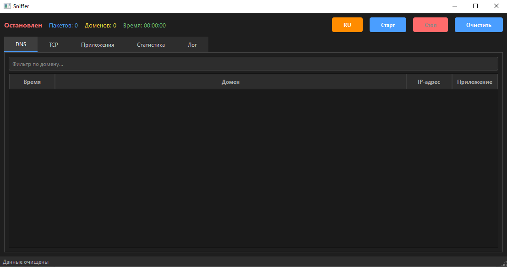

# 🕵️ Sniffer - Анализатор сетевого трафика

**Sniffer** - это десктопное приложение с графическим интерфейсом для перехвата и анализа DNS-запросов и TCP-соединений. Оно показывает, какие домены и IP-адреса запрашиваются вашим компьютером, и определяет, какие приложения их инициируют. Программа наглядно демонстрирует, какую информацию о вашей активности видит системный администратор в локальной сети.

---

## 📦 Возможности

- **Перехват DNS-запросов** в реальном времени с отображением доменов, IP-адресов и имени процесса.
- **Мониторинг TCP-соединений** с деталями (порты, объём трафика, время первого появления).
- **Определение приложений**, создающих трафик (Chrome, Telegram, системные процессы и др.).
- **Двуязычный интерфейс** - переключение между русским и английским языками одной кнопкой.
- **Сортировка данных**:
  - В таблицах DNS/TCP - по любому столбцу (щелчок по заголовку).
  - В списке приложений - по количеству запросов или по имени.
- **Фильтрация DNS-запросов** по домену (поле поиска).
- **Статистика** по протоколам и общий объём трафика.
- **Логирование** всех событий во вкладке «Лог».
- **Работа под Windows** (требует административных прав для захвата пакетов).

---

## 🖥️ Скриншот интерфейса

*Главное окно с вкладками: DNS, TCP, Приложения, Статистика, Лог.*

---

## 📋 Требования

- **Операционная система**: Windows 7/10/11 (x64).
- **Python 3.8+** (если запуск из исходников).
- **Драйвер Npcap** (или WinPcap) - необходим для захвата пакетов.  
  Скачайте и установите [Npcap](https://npcap.com/) с опцией *Install in WinPcap API‑compatible Mode*.
- **Права администратора** - обязательное условие для перехвата трафика.

---

## 🚀 Запуск из исходников

1. Клонируйте репозиторий или скачайте `Sniffer.py`.
2. Создайте и активируйте виртуальное окружение:
   ```bash
   python -m venv venv
   venv\Scripts\activate
   ```      
3. Установите зависимости:
   ```bash
   pip install -r requirements.txt
   ```
   Или вручную:
   ```bash
   pip install PySide6 psutil scapy
   ```
4. Запустите программу от имени администратора:
   ```bash
   python Sniffer.py

---

# 🕵️ Sniffer - Network Traffic Analyzer

**Sniffer** is a desktop application with a graphical interface for intercepting and analyzing DNS queries and TCP connections. It shows which domains and IP addresses your computer requests and identifies which applications initiate them. The program clearly demonstrates what information about your activity is visible to a system administrator on the local network.

---

## 📦 Features

- **Real-time DNS interception** displaying domains, IP addresses, and process names.
- **TCP connection monitoring** with details (ports, traffic volume, first seen time).
- **Application identification** for traffic sources (Chrome, Telegram, system processes, etc.).
- **Bilingual interface** – switch between Russian and English with one button.
- **Data sorting**:
  - In DNS/TCP tables – by any column (click on the header).
  - In the applications list – by request count or by name.
- **DNS filtering** by domain (search field).
- **Protocol statistics** and total traffic volume.
- **Event logging** in the "Log" tab.
- **Windows support** (requires administrator privileges for packet capture).

---

## 🖥️ Interface Screenshot

*Main window with tabs: DNS, TCP, Applications, Statistics, Log.*


---

## 📋 Requirements

- **Operating system**: Windows 7/10/11 (x64).
- **Python 3.8+** (if running from source).
- **Npcap driver** (or WinPcap) – required for packet capture.  
  Download and install [Npcap](https://npcap.com/) with the *Install in WinPcap API‑compatible Mode* option.
- **Administrator privileges** – mandatory for traffic interception.

---

## 🚀 Running from Source

1. Clone the repository or download `Sniffer.py`.
2. Create and activate a virtual environment:
   ```bash
   python -m venv venv
   venv\Scripts\activate
   ```      
3. Install dependencies:
   ```bash
   pip install -r requirements.txt
   ```
   Or manually:
   ```bash
   pip install PySide6 psutil scapy
   ```
4. Run the program as administrator:
   ```bash
   python Sniffer.py
